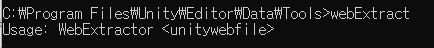

# Unity AssetBundle Decompress

Unity에서 사용하는 AssetBundle 파일(*.ab)를 Unity의 Tool을 이용하여 Decompress하고, 해당 내용을 살펴보는 방법

# 사용되는 툴

Unity Engine의 Tool중 
1) webExtract
2) binary2Text를 사용한다.
두가지 툴 모두 UnityEngine/Editor/Data/Tools 폴더 하에 있다.

# webExtract의 명령어

명령어의 내용은 단순하며, 해당 ab파일의 경로를 입력하게 되면, 파일의 위치에 ab파일의 이름으로 새로운 폴더가 생성되며 ab data파일이 생성되어져 있다.

# binary2Text의 명령어

# 실행 순서

ab파일의 실행순서는 webExtract를 통해 ab파일을 추출을 한후, binary2Text를 통해 binary파일을 Text파일로 변환하면 된다.
해당 ab의 Dependency정보 및 obj들의 정보를 알 수 있으며, link정보는 serial number로 구성되어 있으므로 해당 내용 참조하여 분석하면 된다.

### Reference

Unity Korea Youtube : 에셋번들 실전 가이드([https://youtu.be/Lx61ZEKEvnQ](https://youtu.be/Lx61ZEKEvnQ))